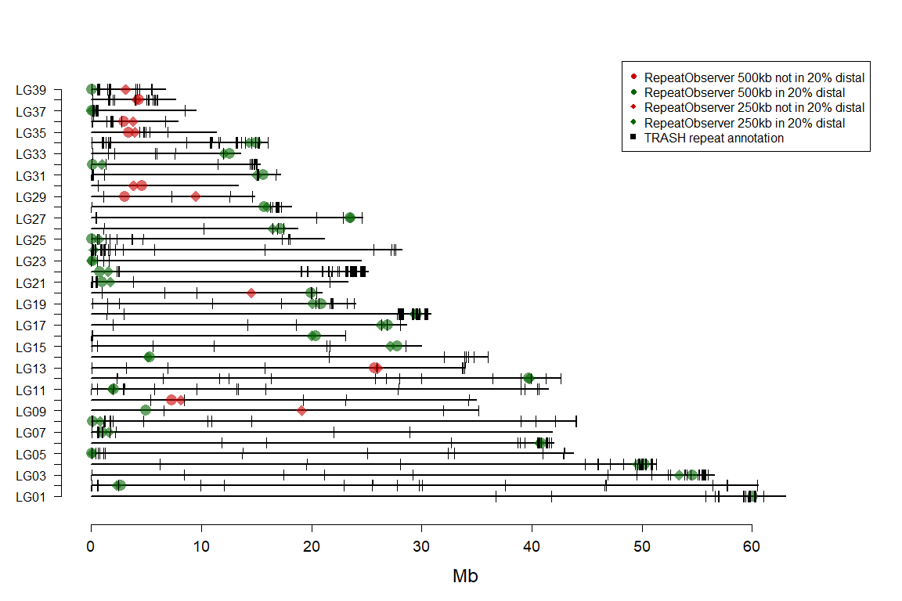

Annotating centromeres
================
Alexandros Topaloudis

# Short Introduction

To annotate centromeres we use two methods that are based on the idea
that centromeres harbour and are surrounded by tandem repeats. The first
approach is RepeatObserver which uses a DNA walk to identify repeats and
quantifies their diversity using Shannon’s diversity index. The second
is TRASH which annotates tandem repeats in a genome using k-mers.

We ran both software with default parameteres on a modified version of
the reference fasta file after removing the ‘N’ nucleotides introduced
with Bionano.

`sed 's/n//g' genome.fasta > genome_noN.fasta`

RepeatObserver was ran as:
`srun Setup_Run_Repeats.sh -i Tytoalba -f genome_noN.fasta  -h H0 -c 15 -m 125000 -g FALSE`

TRASH was ran as:
`bash TRASH_run.sh ../genome_noN.fasta -o out/ --par 12`

We then used the output file
‘Summary.of.repetitive.regions.genome_noN.fasta’ of TRASH and the
Shannon diversity minima on different window lengths of RepeatObserver
to identify centromeres.

We transformed things from the Super-Scaffold to the Linkage group scale
in script.

<details>
<summary>
Click here
</summary>

``` r
# read linkage groups first: 
lg <- read.csv('../2.metadata/supp_table_lgs.csv')
lg$Super.Scaffold <- paste0('Super-Scaffold_',lg$Super.Scaffold) # add prefix 
lg$Linkage.group <- paste0('LG',ifelse(lg$Linkage.group < 10,paste0(0,lg$Linkage.group), lg$Linkage.group)) # make orderable
lg$Super.Scaffold[lg$Linkage.group=='LG24'] <- 'Super-Scaffold_2.2' # modify LG24 to ease splitting in other datasets 
lg <- lg[order(lg$Linkage.group),] # order

# real lengths of scaffolds
len <- read.table('../1.data/3.windows/genome_5mb_windows.bed') # from 5Mb windows
len <- aggregate(len$V3,by=list(len$V1),FUN=max) # get max position 
names(len) <- c('ss','len') 

# add ss2.2
len <- rbind.data.frame(len,
                        data.frame(ss='Super-Scaffold_2.2',
                                   len=len2.2)
                        ) #  

# fix ss2 length to account for removing ss2.2
len$len[len$ss=='Super-Scaffold_2'] <- len$len[len$ss=='Super-Scaffold_2'] - start2
# filter only scaffolds that made it in Linkage map 
len <- len[len$ss %in% lg$Super.Scaffold,]
# make Mb for plot
len$len <- len$len / 1e6

# TRASH
trash <- read.csv('trash/Summary.of.repetitive.regions.genome_nomask_noN.fasta.csv')
trash <- trash[trash$repeats.identified >0 ,] # throw away 0 rows

# make second ss2 correct
# first rename all that belong to ss2.2 
trash$name[trash$name == 'Super-Scaffold_2' & trash$start < len2.2] <- 'Super-Scaffold_2.2'
# then fix coordinates of ss2 
trash$start[trash$name == 'Super-Scaffold_2'] <- trash$start[trash$name == 'Super-Scaffold_2'] - start2
trash$end[trash$name == 'Super-Scaffold_2'] <- trash$end[trash$name == 'Super-Scaffold_2'] - start2
# annotate if telomeric 
# telo <- 'TTAGGGTT'
# centro <- 'CAGCACTGTTTCCTCCAAACTACCATGCTGCGCATAGCAATCCCTGTCTAGCTGCTTCCTTTCACTGGGAACACA'
# kin <- 'GTCACGTGGTC'
# for(i in 1:nrow(trash)){
# print(grep(centro,trash$consensus.primary[i]))
#   print(grep(centro,trash$consensus.secondary[i]))
# }

# RepeatObserver 
# get name translator cause RepeatObserver names things internally :shrug:
n <- read.table('chromosome_renaming.txt',h=T)
n$ss <- gsub('.fasta','',n$Old_Name) # remove suffix to match ss
# add ss2.2
n <- rbind.data.frame(n,
                      data.frame(Old_Name='',
                                 New_Name='Tytoalba_H0-AT_Chr13',
                                 ss='Super-Scaffold_2.2')
                      ) 
n$New_Name <- gsub('alba','alba2',n$New_Name)
# keep only LGs 
n <- n[n$ss %in% lg$Super.Scaffold,]
# make new columns with centromere annotations
n$centro25 <- NA # 25kb
n$centro100 <- NA # 100kb
n$centro250 <- NA # 250kb
n$centro500 <- NA # 500kb


# fill centromere annotations by reading from file
for(i in 1:nrow(n)){
  tmp <- read.table(paste0('RepeatObserver_Centromere_annotation/',n$New_Name[i],'_Centromere_MIN_Shannon.txt'))
  n$centro25[i] <- tmp$V2[1]  / 1e6 # make on Mb scale
  n$centro100[i] <- tmp$V2[2] / 1e6 
  n$centro250[i] <- tmp$V2[3]  / 1e6
  n$centro500[i] <- tmp$V2[4]  / 1e6
  
  # if SS2 we need to fix coordinates by removing the starting point 
  if(n$ss[i]=='Super-Scaffold_2'){
    n$centro25[i] <- n$centro25[i] - (start2 / 1e6)
    n$centro100[i] <-n$centro100[i]  - (start2 / 1e6)
    n$centro250[i] <- n$centro250[i]  - (start2 / 1e6)
    n$centro500[i] <- n$centro500[i]  - (start2 / 1e6)
  } else if(n$ss[i]=='Super-Scaffold_2.2'){
    # if ss2.2 we need to subset 
    n$centro25[i] <- ifelse(n$centro25[i] > len2.2/1e6,NA,n$centro25[i])
    n$centro100[i] <- ifelse(n$centro100[i] > len2.2/ 1e6,NA,n$centro100[i])
    n$centro250[i] <- ifelse(n$centro250[i] > len2.2/1e6,NA,n$centro250[i])
    n$centro500[i] <- ifelse(n$centro500[i] > len2.2/1e6,NA,n$centro500[i])
  }
}
# some of ss2 will be before its start so we set to NA 
n$centro25 <- ifelse(n$centro25 < 0, NA, n$centro25)
n$centro100 <- ifelse(n$centro100 < 0, NA, n$centro100)
n$centro250 <- ifelse(n$centro250 < 0, NA, n$centro250)
n$centro500 <- ifelse(n$centro500 < 0, NA, n$centro500)

# i add length to n dataframe cause its easier to calculate distance from end 
n$len <- len$len[match(len$ss,n$ss)]
```

</details>

When we plot we also annotate the centromere from RepeatObserver based
on its distance to the end of the Linkage group. This is because most
chromosomes of the barn owl species we work in are expected to be
acro/telo-centric.

<details>
<summary>
Click here
</summary>

``` r
# initialize plot 
plot(0,pch='',xlim=c(0,max(len$len)+5),ylim=c(0,nrow(lg)+1),xlab='Mb',ylab='',
     axes=F,cex.lab=1.5)
# add axes
axis(1,at=seq(0,max(lg$Length),by=10),cex.axis=1.2)  
axis(2,at=seq(1,nrow(lg)),labels=rep(lg$Linkage.group),las=2)

# loop through scaffolds and make lines with segments 
for(focus in lg$Super.Scaffold) {
  # this is simply a 1:39 counter for y - axis 
  y = which(lg$Super.Scaffold == focus) 
  # draw line that corresponds to length
  segments(x0=0, x1=len$len[len$ss == focus] ,
           y0=y, y1=y,lwd=2)
  
  ### REPEATOBSERVER ### 
  # subset n for ease of access
  tmpn <- n[n$ss==focus,]
  # Get distance to end (ifelse checks if its closer to right or left hand end)
  dist <- ifelse( (tmpn$len - tmpn$centro250)/tmpn$len < tmpn$centro250/tmpn$len, # test distance from end or from start
                  (tmpn$len-tmpn$centro250)/tmpn$len,  # end 
                  tmpn$centro250/tmpn$len)   # start 
  # add points colored on distal / non-distal 
  points(x=n$centro250[n$ss==focus],y=y, cex=2,col=add.alpha(c('red3','darkgreen'),.6)[as.numeric(dist < cutoff) + 1 ],
         pch=c(18,18)[as.numeric(dist < cutoff) + 1 ])
  # same but for 500kb
  tmpn <- n[n$ss==focus,]
  dist <- ifelse( (tmpn$len - tmpn$centro500)/tmpn$len < tmpn$centro500/tmpn$len, # test distance from end or from start
                  (tmpn$len-tmpn$centro500)/tmpn$len,  # end 
                  tmpn$centro500/tmpn$len)   # start 
  points(x=n$centro500[n$ss==focus],y=y, cex=2,col=add.alpha(c('red3','darkgreen'),.6)[as.numeric(dist < cutoff) + 1 ],
         pch=c(16,16)[as.numeric(dist < cutoff) + 1 ])
  
 
  ### TRASH ###
  # subset only ss
  tmp <- trash[trash$name == focus,]  
  # if there are repeats 
  if(nrow(tmp) > 0){
  for(i in 1:nrow(tmp)){
    # draw a segment for each 
    segments(x0=tmp$start[i]/1e6, x1=tmp$end[i]/1e6,
             y0=y-.5, y1=y+.5, col='black')
  }
  }
}
# add legend
legend('topright',pch=c(16,16,18,18,15),col=c('red3','darkgreen','red3','darkgreen','black'),
       legend=c(paste0('RepeatObserver 500kb not in ',cutoff * 100,'% distal'),
                paste0('RepeatObserver 500kb in ',cutoff * 100,'% distal'),
                paste0('RepeatObserver 250kb not in ',cutoff * 100,'% distal'),
                paste0('RepeatObserver 250kb in ',cutoff * 100,'% distal'),
                'TRASH repeat annotation'),
       cex=1)
```

<!-- -->
</details>

Often the annotation of RepeatObserver and TRASH overlap but often they
dont. The manual curation goes through each linkage group. LGs 01 - 08
look alright because the points from RepeatObserver are distal, overlap
TRASH tandem repeats and the 250 and 500kb points are overlapping.

This is not true for LG09 and LG10. There the centromeres are non-distal
and in LG09 the two scales of RepeatObserver do not agree. Further,
there is weak annotation of tandem repeats in the seqeuence. For these
reasons we conclude that centromere annotation failed in these linkage
groups.

Using the same logic we discard LG13 (non-distal centromere away from
TRASH tandem), LG29 and LG30.

Last there are some cases where the TRASH tandem annotations are on the
opposite end of the RepeatObserver centromeres. Repeats are found in
both centromeres and telomeres. In the case of metacentric chromosomes a
distinction is easy, telomeres should be placed at the end of
chromosomes and centromeres in the middle, if the assembly is true. In
acro/telo-centric chromosomes like ours the situation is a bit more
complicated. In fact without molecular information it is impossible to
know for sure if we are finding centromeres or telomeres through
in-silico annotation.

We still assume that when RepeatObserver and TRASH agree, the annotation
is true. THis leaves annotated centromeres in the following linkage
groups: LG01, LG02, LG03, LG04, LG05, LG06, LG07, LG08, LG11, LG18,
LG19, LG21,LG23, LG24, LG25, LG26, LG28, LG37

<style>
div.hidecode + pre {display: none}
</style>

<div class="hidecode">

</div>

``` r
good <- c('LG01', 'LG02', 'LG03', 'LG04', 'LG05', 'LG06', 'LG07', 'LG08', 'LG11', 'LG18', 'LG19', 'LG21','LG23', 'LG24', 'LG25', 'LG26', 'LG28', 'LG37')

lg$centro <- NA
lg$centro[lg$Linkage.group %in% good] <- n$centro500[match(lg$Super.Scaffold[lg$Linkage.group %in% good], n$ss)]
# LG24 only at 250
lg$centro[lg$Linkage.group=='LG24'] <- n$centro250[n$ss=='Super-Scaffold_2.2']

out1 <- lg
out1 <- out1[,c(1,12)]
out1$Linkage.group <- gsub('LG0?','',out1$Linkage.group)
names(out1) <- c('lg','centro')
write.csv(out1,'centromeres.csv',row.names=F,quote=F)
```

We have thus annotated centromeres in 18 out of 39 Linkage groups.

The following code simply plots the ones annotated and the ones not for
clarity

<details>
<summary>
Click here
</summary>

``` r
# initialize plot 
plot(0,pch='',xlim=c(0,max(len$len)+5),ylim=c(0,nrow(lg)+1),xlab='Mb',ylab='',
     axes=F,cex.lab=1.5)
# add axes
axis(1,at=seq(0,max(lg$Length),by=10),cex.axis=1.2)  
axis(2,at=seq(1,nrow(lg)),labels=rep(lg$Linkage.group),las=2)

# loop through scaffolds and make lines with segments 
for(focus in lg$Super.Scaffold) {
  # this is simply a 1:39 counter for y - axis 
  y = which(lg$Super.Scaffold == focus) 
  coll = c('red4','green3')[if(lg$Linkage.group[lg$Super.Scaffold==focus] %in% good){2}else{1} ]
  # draw line that corresponds to length
  segments(x0=0, x1=len$len[len$ss == focus] ,
           y0=y, y1=y,lwd=2,col=coll)
  
  ### REPEATOBSERVER ### 
  # subset n for ease of access
  tmpn <- n[n$ss==focus,]
  # Get distance to end (ifelse checks if its closer to right or left hand end)
  dist <- ifelse( (tmpn$len - tmpn$centro250)/tmpn$len < tmpn$centro250/tmpn$len, # test distance from end or from start
                  (tmpn$len-tmpn$centro250)/tmpn$len,  # end 
                  tmpn$centro250/tmpn$len)   # start 
  # add points colored on distal / non-distal 
  points(x=n$centro250[n$ss==focus],y=y, cex=2,col=add.alpha(c('red3','darkgreen'),.6)[as.numeric(dist < cutoff) + 1 ],
         pch=c(18,18)[as.numeric(dist < cutoff) + 1 ])
  # same but for 500kb
  tmpn <- n[n$ss==focus,]
  dist <- ifelse( (tmpn$len - tmpn$centro500)/tmpn$len < tmpn$centro500/tmpn$len, # test distance from end or from start
                  (tmpn$len-tmpn$centro500)/tmpn$len,  # end 
                  tmpn$centro500/tmpn$len)   # start 
  points(x=n$centro500[n$ss==focus],y=y, cex=2,col=add.alpha(c('red3','darkgreen'),.6)[as.numeric(dist < cutoff) + 1 ],
         pch=c(16,16)[as.numeric(dist < cutoff) + 1 ])
  
 
  ### TRASH ###
  # subset only ss
  tmp <- trash[trash$name == focus,]  
  # if there are repeats 
  if(nrow(tmp) > 0){
  for(i in 1:nrow(tmp)){
    # draw a segment for each 
    segments(x0=tmp$start[i]/1e6, x1=tmp$end[i]/1e6,
             y0=y-.5, y1=y+.5, col='black')
  }
  }
}
# add legend
legend('topright',pch=c(16,16,18,18,15),col=c('red3','darkgreen','red3','darkgreen','black'),
       legend=c(paste0('RepeatObserver 500kb not in ',cutoff * 100,'% distal'),
                paste0('RepeatObserver 500kb in ',cutoff * 100,'% distal'),
                paste0('RepeatObserver 250kb not in ',cutoff * 100,'% distal'),
                paste0('RepeatObserver 250kb in ',cutoff * 100,'% distal'),
                'TRASH repeat annotation'),
       cex=1)
```

<!-- -->
</details>
